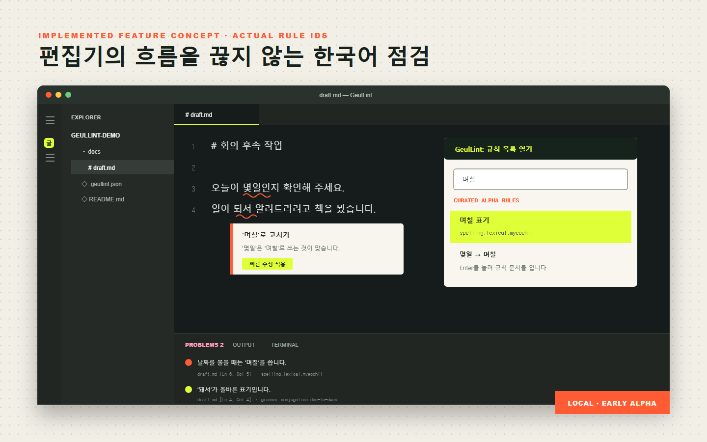

<p align="center"></p>

<p align="center">
  <a href="README.md">한국어</a> · <a href="README.en.md">English</a> ·
  <a href="README.ja.md">日本語</a> · <a href="README.zh-CN.md"><strong>简体中文</strong></a>
</p>

<p align="center">
  <a href="https://github.com/binibinibin123/geullint/actions/workflows/ci.yml"></a>
  <a href="https://github.com/binibinibin123/geullint/releases"></a>
  <a href="CHANGELOG.md"></a>
  <a href="LICENSE"></a>
</p>

<p align="center"><strong>不上传文本的开源韩语拼写与语法检查器</strong><br>在浏览器、VS Code 和终端中检查韩语拼写、空格、语法与文体。文本不会发送到外部服务器。</p>

<p align="center">
  <a href="https://binibinibin123.github.io/geullint/"><strong>立即检查句子 →</strong></a> ·
  <a href="#安装">安装</a> ·
  <a href="docs/rules.md">查看已验证规则</a>
</p>

<p align="center"></p>

## 在任何写作场景中使用

先在网页中检查一句话；随着项目扩大，再把同一个检查器接入编辑器、终端和 CI。

| 使用场景 | GeulLint 可以做什么 |
| --- | --- |
| VS Code | 输入时实时检查，并一键应用保守修复 |
| CLI | 用一条命令批量检查多个文档或整个仓库 |
| CI | 自动阻止文档质量回退并生成 SARIF 结果 |
| 自定义词汇 | 添加用户词典、dictionary overlay 和项目 rule pack |

文本、诊断和遥测不会发送到外部服务。已发布的 alpha 版本是 **v0.3.0-alpha.1**；此仓库的规则目录会持续演进，不以固定的规则数量为目标。

## 为什么选择 GeulLint

GeulLint 是完全在浏览器、编辑器和终端中**离线**运行的韩语拼写与语法检查器。对于相同文本、输入类型和配置档，同一个 Rust 引擎会在各处返回一致的规则 ID 与修复结果。它检查 Markdown 正文以及 JavaScript、TypeScript、Python、Rust 注释，并排除已识别的代码与字符串范围。

| 能力 | 内容 |
| --- | --- |
| 隐私 | 文本、诊断和遥测的网络请求为 0 |
| 开放规则 | 稳定 ID、说明、示例、严重级别和测试 |
| 自动化 | 人类可读输出、JSON、SARIF 2.1.0、LSP、退出码 |
| 自定义 | 用户词典、dictionary overlay、本地 rule pack |
| 平台 | Windows、macOS、Linux，支持 x64 与 ARM64 |

## 安装

无需安装即可使用[本地 WebAssembly 演练场](https://binibinibin123.github.io/geullint/)。

**Windows**

```powershell
$env:GEULLINT_VERSION='0.3.0-alpha.1'
irm https://raw.githubusercontent.com/binibinibin123/geullint/v0.3.0-alpha.1/install.ps1 | iex
geullint .
```

**macOS / Linux**

```bash
curl -fsSL https://raw.githubusercontent.com/binibinibin123/geullint/v0.3.0-alpha.1/install.sh | GEULLINT_VERSION=0.3.0-alpha.1 sh
geullint .
```

脚本会验证 GitHub Release 的 SHA-256。执行前可阅读 [install.ps1](install.ps1) 或 [install.sh](install.sh)。如果已经安装 Rust：

```bash
cargo install --git https://github.com/binibinibin123/geullint --tag v0.3.0-alpha.1 --locked geullint-cli
```

手动压缩包是 [GitHub Releases](https://github.com/binibinibin123/geullint/releases)提供的 fallback。

目录扫描会遵循现有 `.gitignore` 与项目专用 `.geullintignore` 模式。

## 规则与质量

规则目录由规则元数据和已检查的示例生成。规则数量并不是质量声明：测试包含错误用例和正常反例，但这些用例不能证明通用的 precision 或 recall。能安全自动应用的更正也会刻意比“需要人工确认的建议”更保守。评估约定见[质量门槛](docs/quality.md)和[语料评估](docs/corpus-evaluation.md)。

参阅[全部规则](docs/rules.md)、[质量门槛](docs/quality.md)、[语料评估](docs/corpus-evaluation.md)与[离线策略](docs/offline.md)。

## VS Code

<p align="center"><br><sub>此图依据已实现功能和真实规则 ID 绘制；具体布局可能随 VS Code 版本而变化。</sub></p>

从 [Releases](https://github.com/binibinibin123/geullint/releases)下载与平台匹配的 VSIX，然后选择 `Extensions: Install from VSIX...`。本地语言服务器已包含在内，无需 Rust、Node.js 或 API 密钥。

## 限制与贡献

GeulLint 是保守的规则型检查器，目前尚未内置通用未知词词典，因此可能漏掉公开规则之外的任意拼写错误。它不能替代长上下文语义判断或创作编辑。只有在语料具备许可证、哈希和可审查记录时，项目才会公布独立指标。

欢迎阅读 [CONTRIBUTING.md](CONTRIBUTING.md)、[ARCHITECTURE.md](ARCHITECTURE.md)和 [ROADMAP.md](ROADMAP.md)。安全问题请按 [SECURITY.md](SECURITY.md)私下报告。

MIT 许可证。第三方许可见 [THIRD_PARTY_NOTICES.md](THIRD_PARTY_NOTICES.md)。
